# Color Scale and Display Mode Refactoring Plan

## Problem Summary

The current codebase has several architectural issues:

1. **Shared Color Scale**: A and B display modes share the same `colorScale` object, causing color changes in one mode to affect the other
2. **Dual Notification Paths**: Widgets subscribe to event bus events that are never published, while `NotificationCoordinator` directly calls update methods
3. **Unclear Responsibilities**: `NotificationCoordinator` fetches color scales from `ContactMatrixView` to pass to widgets, creating indirect dependencies
4. **Confusing Naming**: "A" and "B" modes aren't clearly documented as "contact map" vs "control map" - this relationship gets lost in the codebase

## Refactoring Strategy

Following Martin Fowler's refactoring principles: Extract Method, Extract Class, Replace Conditional with Polymorphism, Remove Dead Code, and Introduce Parameter Object.

## Architecture Overview

```mermaid
graph TB
    subgraph "Color Scale Management"
        CSM[ColorScaleManager]
        CSA[ColorScale for Map A]
        CSB[ColorScale for Map B]
        RCS[RatioColorScale]
        DCS[DiffColorScale]
    end
    
    subgraph "Display Modes"
        DM[DisplayMode]
        A[Mode A: Contact Map]
        B[Mode B: Control Map]
        AOB[Mode AOB: Ratio A/B]
        BOA[Mode BOA: Ratio B/A]
    end
    
    subgraph "Rendering"
        CMV[ContactMatrixView]
        CMV -->|uses| CSM
    end
    
    subgraph "UI Components"
        CSW[ColorScaleWidget]
        CMW[ControlMapWidget]
        NC[NotificationCoordinator]
    end
    
    CSM --> CSA
    CSM --> CSB
    CSM --> RCS
    CSM --> DCS
    
    DM --> A
    DM --> B
    DM --> AOB
    DM --> BOA
    
    NC -->|notifies| CSW
    NC -->|notifies| CMW
    CSM -->|provides| NC
```



## Implementation Steps

### Phase 1: Create ColorScaleManager (Extract Class)

**File**: `js/colorScaleManager.js` (new file)

Create a new class to manage all color scales with **explicit naming** that makes the A=Contact Map, B=Control Map relationship clear:

```javascript
/**
 * Manages color scales for all display modes.
 * 
 * Terminology:
 * - Display Mode A = Contact Map (main/primary dataset)
 * - Display Mode B = Control Map (secondary/comparison dataset)
 * - AOB/BOA modes = Ratio comparisons between contact and control maps
 */
class ColorScaleManager {
    constructor() {
        // Use explicit names: contactMap = A, controlMap = B
        this.contactMapColorScale = new ColorScale(defaultColorScaleConfig);
        this.controlMapColorScale = new ColorScale(defaultColorScaleConfig);
        this.ratioColorScale = new RatioColorScale(defaultRatioColorScaleConfig.threshold);
        // Initialize ratio scales with defaults
    }
    
    /**
     * Get the appropriate color scale for a display mode.
     * @param {string} displayMode - 'A' (Contact Map), 'B' (Control Map), 'AOB', 'BOA', or 'AMB'
     * @returns {ColorScale|RatioColorScale} The color scale for the display mode
     */
    getColorScaleForDisplayMode(displayMode) {
        switch(displayMode) {
            case 'A': // Contact Map
                return this.contactMapColorScale;
            case 'B': // Control Map
                return this.controlMapColorScale;
            case 'AOB':
            case 'BOA': 
                return this.ratioColorScale;
            case 'AMB': 
                return this.diffColorScale;
            default: 
                return this.contactMapColorScale;
        }
    }
    
    // Explicit getters with clear names
    getContactMapColorScale() { return this.contactMapColorScale; }
    getControlMapColorScale() { return this.controlMapColorScale; }
    getRatioColorScale() { return this.ratioColorScale; }
    
    // Methods for updating individual scales
    setContactMapColorScale(colorScale) { this.contactMapColorScale = colorScale; }
    setControlMapColorScale(colorScale) { this.controlMapColorScale = colorScale; }
    setRatioColorScale(ratioColorScale) { this.ratioColorScale = ratioColorScale; }
    
    // Legacy aliases for backward compatibility (documented as A/B)
    get colorScaleA() { return this.contactMapColorScale; }
    get colorScaleB() { return this.controlMapColorScale; }
}
```

**Benefits**:

- Centralizes color scale management
- Makes it explicit that A = Contact Map, B = Control Map through naming
- Provides both explicit and legacy access patterns

### Phase 2: Update ContactMatrixView (Replace Conditional with Polymorphism)

**File**: `js/contactMatrixView.js`

- Remove `colorScale`, `ratioColorScale` properties
- Add `colorScaleManager` property
- Update `getColorScale()` to delegate to `ColorScaleManager`
- Update rendering code (line 427) to use appropriate scale with explicit naming:
  ```javascript
  case 'A': // Contact Map
      rgba = this.colorScaleManager.getContactMapColorScale().getColor(rec.counts);
      break;
  case 'B': // Control Map
      rgba = this.colorScaleManager.getControlMapColorScale().getColor(rec.counts);
      break;
  ```

- Add comments throughout rendering code clarifying dataset usage:
  ```javascript
  // In repaint() method around line 238:
  switch (this.displayMode) {
      case 'B': // Control Map mode - display controlDataset
          zoom = getBZoomIndex(state.zoom);
          ds = controlDataset; // controlDataset = B = Control Map
          break;
      // ... etc
  }
  ```

**Benefits**: Clear separation of scales, eliminates shared state bug.

### Phase 3: Update NotificationCoordinator (Remove Dead Code, Extract Method)

**File**: `js/notificationCoordinator.js`

- Update `_updateColorScaleWidgetForDisplayMode()` to get scales from `ColorScaleManager`:
  ```javascript
  _updateColorScaleWidgetForDisplayMode(mode) {
      const colorScaleWidget = this._getUIComponent('colorScaleWidget');
      if (colorScaleWidget) {
          const manager = this.browser.contactMatrixView.colorScaleManager;
          const colorScale = manager.getColorScaleForDisplayMode(mode);
          const ratioColorScale = manager.ratioColorScale;
          colorScaleWidget.updateForDisplayMode(mode, ratioColorScale, colorScale);
      }
  }
  ```

**Benefits**: Direct access to color scales, clearer data flow.

### Phase 4: Remove Dead Event Bus Subscriptions (Remove Dead Code)

**Files**:

- `js/hicColorScaleWidget.js` (lines 93-102)
- `js/controlMapWidget.js` (lines 63-65)

Remove event bus subscriptions for "DisplayMode" since:

1. These events are never published
2. `NotificationCoordinator` handles updates directly
3. Creates confusion about which notification path is active

**Benefits**: Eliminates duplicate/conflicting notification paths, reduces confusion.

### Phase 5: Update ColorScaleWidget (Simplify Dependencies)

**File**: `js/hicColorScaleWidget.js`

- Update `updateForDisplayMode()` to accept `ColorScaleManager` instead of individual scales
- Update `createColorPicker()` to use `ColorScaleManager.getColorScaleForDisplayMode()`
- Remove direct access to `browser.contactMatrixView.colorScale` and `ratioColorScale`

**Benefits**: Single source of truth for color scales, clearer dependencies.

### Phase 6: Update BrowserUIManager (Move Initialization)

**File**: `js/browserUIManager.js`

- Remove color scale creation (lines 78-81)
- Create `ColorScaleManager` instance
- Pass `ColorScaleManager` to `ContactMatrixView` constructor

**Benefits**: Centralized initialization, clearer ownership.

### Phase 7: Update HICBrowser (Delegate to ColorScaleManager)

**File**: `js/hicBrowser.js`

- Update `getColorScale()` to delegate to `ColorScaleManager`:
  ```javascript
  getColorScale() {
      if (!this.contactMatrixView) return undefined;
      return this.contactMatrixView.colorScaleManager
          .getColorScaleForDisplayMode(this.getDisplayMode());
  }
  ```

**Benefits**: Consistent API, single source of truth.

### Phase 8: Clarify Terminology Throughout Codebase (Rename for Clarity)

**Files**: All modified files, especially:

- `js/contactMatrixView.js`
- `js/controlMapWidget.js`
- `js/hicBrowser.js`
- `js/dataLoader.js`

**Key Changes**:

1. **Add comprehensive JSDoc comments** at class and method levels:
   ```javascript
   /**
    * Display modes for Hi-C contact matrix visualization:
    * - 'A': Contact Map (main/primary dataset, browser.dataset)
    * - 'B': Control Map (secondary/comparison dataset, browser.controlDataset)
    * - 'AOB': Ratio mode showing Contact Map / Control Map
    * - 'BOA': Ratio mode showing Control Map / Contact Map
    * - 'AMB': Difference mode (Contact Map - Control Map)
    */
   ```

2. **Rename variables in rendering code** for clarity:

   - `ds` → `contactMapDataset` or `mainDataset` (with comment: "A = Contact Map")
   - `dsControl` → `controlMapDataset` (with comment: "B = Control Map")
   - Keep `controlDataset` as-is (it's already clear)

3. **Update method names and comments**:

   - `getColorScaleForDisplayMode()` - add parameter docs explaining A/B mapping
   - `updateForDisplayMode()` in widgets - add comments about which map is affected

4. **Add inline comments** at key decision points:
   ```javascript
   // Display Mode A = Contact Map (main dataset)
   if (displayMode === 'A') {
       // Use contact map color scale
   }
   
   // Display Mode B = Control Map (control dataset)  
   if (displayMode === 'B') {
       // Use control map color scale
   }
   ```

5. **Update UI labels and tooltips** (if applicable):

   - Ensure "A:" and "B:" labels in UI clearly indicate "Contact Map" and "Control Map"

**Benefits**:

- Self-documenting code that makes the A=Contact Map, B=Control Map relationship impossible to miss
- Reduces future confusion for developers
- Makes code reviews easier

## Testing Strategy

1. **Unit Tests**: Test `ColorScaleManager` independently
2. **Integration Tests**: Verify A and B modes maintain separate colors
3. **Regression Tests**: Ensure ratio modes (AOB/BOA) still work correctly
4. **Manual Testing**: Verify color picker updates correct scale based on mode

## Migration Notes

- Existing sessions/configs that serialize `colorScale` will need migration logic
- The `colorScaleThresholdCache` key generation may need updates to include A/B distinction
- External API calls to `setColorScale()` should specify which map (A or B)

## Success Criteria

1. A and B modes have independent color scales
2. No duplicate notification paths
3. Clear separation of concerns
4. **The A=Contact Map, B=Control Map relationship is explicit throughout the codebase** (naming, comments, documentation)
5. All existing functionality preserved
6. Code is more maintainable and understandable
7. New developers can immediately understand which map (contact vs control) corresponds to which display mode

## Implementation Status

✅ **COMPLETED** - All phases have been implemented and tested.

### Files Modified

- `js/colorScaleManager.js` (new file)
- `js/browserUIManager.js`
- `js/contactMatrixView.js`
- `js/notificationCoordinator.js`
- `js/hicColorScaleWidget.js`
- `js/controlMapWidget.js`
- `js/hicBrowser.js`
- `js/dataLoader.js`

### Key Improvements

1. **Separate Color Scales**: A and B modes now have independent color scales (`contactMapColorScale` and `controlMapColorScale`)
2. **Clear Terminology**: Throughout the codebase, A=Contact Map and B=Control Map is explicitly documented
3. **Removed Dead Code**: Eliminated unused event bus subscriptions
4. **Better Architecture**: Centralized color scale management through `ColorScaleManager`
5. **Improved Documentation**: Comprehensive JSDoc comments and inline comments clarify the relationship between display modes and datasets

