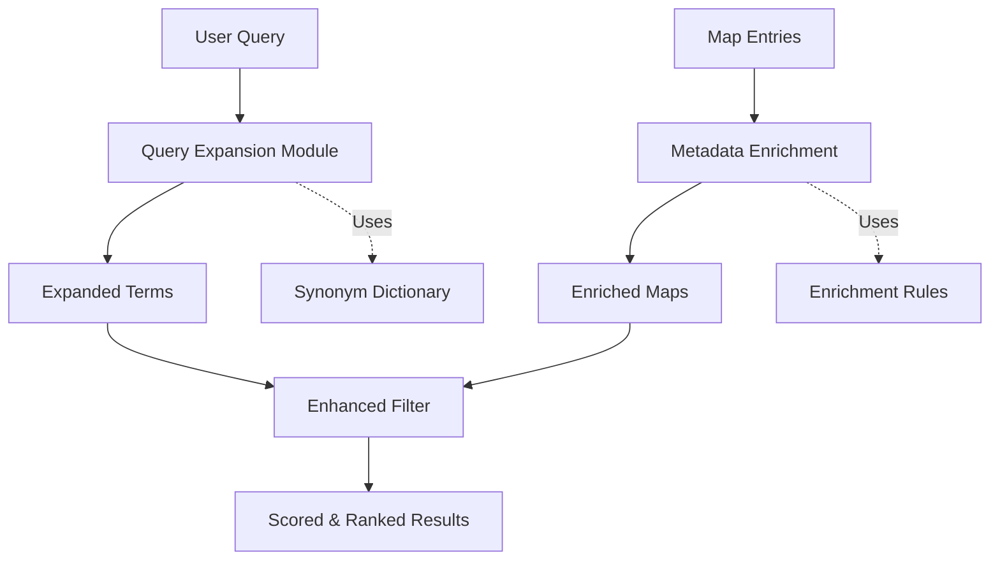

# Enhanced Keyword Search Implementation Plan

## Overview

Enhance the current keyword-based search system (`mapFilter.js`) with three key improvements:

1. **Query Expansion** - Expand queries with synonyms and related terms
2. **Fuzzy Matching** - Handle typos and approximate matches
3. **Metadata Enrichment** - Add computed fields to aid search and reasoning

Note: Field weighting is skipped to avoid over-prioritizing certain metadata fields.

## Architecture



## Implementation Components

### 1. Query Expansion Module

**New File**: `src/queryExpander.js`

- **Purpose**: Expand user queries with synonyms and related terms
- **Key Function**: `expandQuery(query)` - Returns array of expanded terms
- **Synonym Dictionary**: Domain-specific synonyms for genomics terms
  - Species: "human" → ["Homo sapiens", "hg38", "hg19", "hg37"]
  - Species: "mouse" → ["Mus musculus", "mm10", "mm39", "mm9"]
  - Cell types: Common cell line names and aliases
  - Assembly versions: Map common names to version numbers

**Example**:

```javascript
expandQuery("human hg38") 
// Returns: ["human", "homo sapiens", "hg38", "hg19", "hg37"]
```

### 2. Enhanced Filter

**Modified File**: `src/mapFilter.js`

**Changes**:

- Integrate query expansion
- Add fuzzy matching support
- Improve scoring algorithm to handle expanded terms and fuzzy matches

**Scoring Algorithm Updates**:

- Sum scores across all expanded terms (original terms get full weight, expanded synonyms get reduced weight)
- Apply fuzzy matching with reduced scores for approximate matches
- Keep existing URL de-weighting (0.5x multiplier) from current implementation

### 3. Fuzzy Matching

**Implementation**: Simple Levenshtein distance-based matching

- **Threshold**: Terms within 2-3 character edits are considered matches
- **Bonus Scoring**: Fuzzy matches get lower scores than exact matches
- **Use Case**: Handle typos like "hg38" → "hg39" or "human" → "humna"

**Approach**:

- Use a lightweight implementation (no external dependencies)
- Only apply fuzzy matching if exact match fails
- Limit fuzzy matching to terms > 3 characters

### 4. Metadata Enrichment

**New File**: `src/metadataEnricher.js`

**Purpose**: Add computed fields to map entries to aid search and reasoning

**Enrichment Rules**:

- **`_isRecent`**: Boolean flag based on Accession patterns or publication dates (if available)
- **`_normalizedAssembly`**: Standardized assembly names (e.g., "hg38" → "GRCh38")
- **`_species`**: Extracted species name from Biosource/Biosample
- **`_cellTypeCategory`**: Categorized cell types (e.g., "cancer", "normal", "stem")
- **`_searchableText`**: Concatenated searchable fields for full-text matching

**Integration Point**:

- Call enrichment in `dataParsers.js` after parsing TSV data
- Enriched fields prefixed with `_` to distinguish from original metadata

## File Changes

### New Files

1. **`src/queryExpander.js`**

   - `expandQuery(query)` - Main expansion function
   - `SYNONYM_DICTIONARY` - Domain-specific synonyms
   - `expandTerm(term)` - Expand individual terms

2. **`src/metadataEnricher.js`**

   - `enrichMapMetadata(map)` - Enrich single map entry
   - `enrichMaps(maps)` - Enrich array of maps
   - Enrichment rule functions

### Modified Files

1. **`src/mapFilter.js`**

   - Import `queryExpander`
   - Update `filterMaps()` to:
     - Expand queries before filtering
     - Support fuzzy matching
   - Add `fuzzyMatch(term, value)` helper function
   - Update scoring algorithm to handle expanded terms and fuzzy matches

2. **`src/dataParsers.js`**

   - Import `metadataEnricher`
   - Call `enrichMaps()` after parsing TSV data (in `parseTSV()`)
   - Ensure enriched metadata is included in returned map entries

3. **`src/dataSourceConfigs.js`** (Optional)

   - Add field weight configuration per source if needed
   - Document which fields are most important per source

## Implementation Details

### Query Expansion Strategy

- **Case-insensitive**: All expansions are lowercase
- **Bidirectional**: "human" expands to assemblies, assemblies expand to "human"
- **Context-aware**: Consider term position (first term might be species, second might be assembly)
- **Limit expansions**: Don't expand too aggressively (max 3-5 synonyms per term)

### Fuzzy Matching Algorithm

- **Levenshtein Distance**: Calculate edit distance between query term and field value
- **Threshold**: Match if distance ≤ 2 for terms ≤ 5 chars, ≤ 3 for longer terms
- **Scoring**: `fuzzyScore = exactScore * (1 - distance/maxLength) * 0.7`
- **Performance**: Only apply to terms that don't have exact matches

### Metadata Enrichment Rules

- **`_isRecent`**: 
  - Check Accession patterns (newer accessions might indicate recent data)
  - Or parse Publication dates if available
  - Default to `false` if cannot determine

- **`_normalizedAssembly`**:
  - Map common names: "hg38" → "GRCh38", "mm10" → "GRCm38"
  - Keep original in metadata, add normalized version

- **`_species`**:
  - Extract from Biosource: "Homo sapiens" → "human"
  - Extract from Biosample if Biosource unavailable
  - Lowercase, normalized

- **`_cellTypeCategory`**:
  - Pattern matching: "K562", "HeLa" → "cancer"
  - "GM12878", "IMR90" → "normal"
  - "iPSC", "ESC" → "stem"
  - Default to empty string if cannot categorize

- **`_searchableText`**:
  - Concatenate: name + all metadata values (space-separated)
  - Lowercase for consistent searching
  - Used for full-text matching fallback

### Scoring Algorithm

**Current**: Simple score based on match position (exact > starts with > contains)

**Enhanced**:

```javascript
score = baseMatchScore * expansionWeight * fuzzyMultiplier
```

- **baseMatchScore**: Existing scoring (100 for exact, 80 for starts with, 50 for contains)
- **expansionWeight**: 1.0 for original term, 0.8 for expanded synonyms
- **fuzzyMultiplier**: 0.7 for fuzzy matches, 1.0 for exact matches
- **URL matches**: Keep existing 0.5x multiplier for URL field matches

**Final Score**: Sum across all matching terms and fields

## Testing Strategy

1. **Unit Tests** (`test/queryExpander.test.js`):

   - Test query expansion with various inputs
   - Verify synonym dictionary coverage

2. **Unit Tests** (`test/mapFilter.test.js`):

   - Test query expansion integration
   - Test fuzzy matching handles typos
   - Test scoring algorithm produces expected rankings

3. **Unit Tests** (`test/metadataEnricher.test.js`):

   - Test enrichment rules produce correct computed fields
   - Test edge cases (missing fields, empty values)

4. **Integration Tests**:

   - End-to-end: query → expansion → filtering → ranking
   - Verify enriched metadata is available in search results

## Performance Considerations

- **Query Expansion**: Should be fast (< 1ms) - use simple dictionary lookup
- **Fuzzy Matching**: Only apply when exact match fails to avoid performance hit
- **Metadata Enrichment**: Run once per map during parsing, cache results
- **Scoring**: Current O(n*m) complexity where n=maps, m=terms - acceptable for current dataset size

## Backward Compatibility

- **API**: No changes to `filterMaps()` function signature
- **Results**: Enriched fields are additive (prefixed with `_`), don't break existing code
- **Behavior**: Existing queries should work the same or better (more matches via expansion)

## Future Enhancements (Out of Scope)

- Machine learning-based ranking
- User query history for personalization
- Advanced fuzzy matching with phonetic algorithms
- Query suggestion/autocomplete

## Dependencies

- **No new external dependencies required**
- Use built-in JavaScript string methods for fuzzy matching
- Keep implementation lightweight and fast
