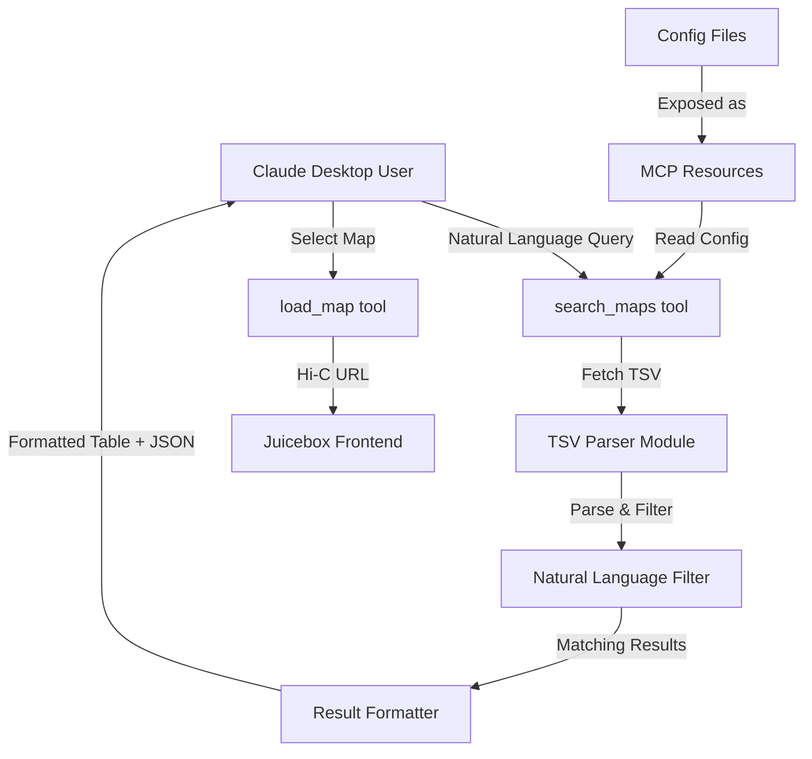

# Data Source Search and Selection Implementation Plan

## Overview

Enable Claude Desktop users to discover, search, and select Hi-C contact maps from TSV-based data sources (4DN, ENCODE) using natural language queries. The system will fetch TSV tables, parse them, filter by user criteria, and present results for review before loading into Juicebox.

## Architecture Flow



## Implementation Components

### 1. Data Source Configuration Module

**File**: `juicebox-mcp/src/dataSourceConfigs.js`

- Import configs from `juicebox-web/js/encodeContactMapDatasourceConfig.js` and `juicebox-web/js/fourdnContactMapDatasourceConfig.js`
- Export unified data source registry with metadata:
  - Source name (4DN, ENCODE)
  - Data URL
  - Column definitions
  - Parser type (TSV for both)

**Key structure**:

```javascript
export const DATA_SOURCES = {
  '4dn': {
    name: '4DN',
    url: 'https://s3.amazonaws.com/igv.org.app/4dn/hic/4dn_hic.txt',
    columns: ['Project', 'Assembly', 'Biosource', ...],
    parserType: 'tsv'
  },
  'encode': {
    name: 'ENCODE',
    url: 'https://s3.amazonaws.com/igv.org.app/encode/hic/hic.txt',
    columns: ['Assembly', 'Biosample', 'Description', ...],
    parserType: 'tsv'
  }
}
```

### 2. Data Parser Module

**File**: `juicebox-mcp/src/dataParsers.js`

- **`parseTSV(url, columns)`**: Fetch and parse TSV files (4DN, ENCODE)
  - Use Node.js `fetch` or `https` module
  - Handle tab-delimited format
  - First line is header row
  - Map columns to objects, extract URL field (first column for 4DN, 'HREF' column for ENCODE)
  - Return array of map entries with all metadata

- **`parseDataSource(sourceId)`**: Unified entry point
  - Fetch and parse TSV data from specified source
  - Cache parsed results (optional, for performance)
  - Return standardized format: `{ url, name, metadata: {...} }`
  - Handle ENCODE URL prefix (`https://www.encodeproject.org` + HREF)

### 3. Natural Language Filter

**File**: `juicebox-mcp/src/mapFilter.js`

- **`filterMaps(maps, query)`**: Filter maps by natural language query
  - Case-insensitive text matching across all metadata fields
  - Support multiple keywords (AND logic)
  - Score matches by relevance (exact match > partial match)
  - Return filtered and sorted results

**Example queries**:

- "human cells" → matches Biosource/Biosample containing "human"
- "hg38" → matches Assembly containing "hg38"
- "mouse hg38" → matches both keywords

### 4. MCP Resources

**File**: `juicebox-mcp/server.js` (add resource handlers)

- **`resources/list`**: Expose data source configs as resources
  - `juicebox://datasource/4dn`
  - `juicebox://datasource/encode`

- **`resources/read`**: Return config JSON for each source
  - Allows Claude to understand available sources and columns

### 5. MCP Tools

**File**: `juicebox-mcp/server.js` (add tool registrations)

#### Tool 1: `list_data_sources`

- Lists available data sources with descriptions
- Returns: Array of source metadata (name, description, column names)

#### Tool 2: `search_maps`

- **Parameters**:
  - `source` (optional): Specific source ID ('4dn', 'encode') or 'all'
  - `query` (required): Natural language search query
  - `limit` (optional): Max results to return (default: 50)
- **Process**:

  1. Fetch and parse data from specified source(s)
  2. Apply natural language filter
  3. Format results as readable table + structured JSON

- **Returns**: 
  - Formatted text table for Claude to display
  - Structured JSON array with map entries (for Claude to parse)
  - Each entry includes: `url`, `name`, `source`, `metadata` object

#### Tool 3: `get_map_details`

- **Parameters**:
  - `source`: Source ID
  - `index`: Index from search results (0-based)
  - OR `url`: Direct URL to map
- **Returns**: Full details of a specific map entry

### 6. Result Formatting

**File**: `juicebox-mcp/src/resultFormatter.js`

- **`formatSearchResults(maps, query)`**: Create formatted text table
  - Column headers: Source, Name/Description, Key Metadata (Assembly, Biosource, etc.)
  - Numbered rows for easy selection
  - Truncate long values for readability
  - Include total count and query summary

**Example output format**:

```
Found 12 maps matching "human hg38":

# | Source | Name/Description | Assembly | Biosource | ...
1 | 4DN    | GM12878 Hi-C     | hg38     | GM12878   | ...
2 | ENCODE | Human Cell Line  | hg38     | K562      | ...
...
```

## File Changes

### New Files

1. `juicebox-mcp/src/dataSourceConfigs.js` - Data source registry (4DN and ENCODE only)
2. `juicebox-mcp/src/dataParsers.js` - TSV parsing
3. `juicebox-mcp/src/mapFilter.js` - Natural language filtering
4. `juicebox-mcp/src/resultFormatter.js` - Result formatting

### Modified Files

1. `juicebox-mcp/server.js`:

   - Add resource handlers (`resources/list`, `resources/read`)
   - Register new tools (`list_data_sources`, `search_maps`, `get_map_details`)
   - Import new modules

## User Workflow

1. **Discovery**: User asks "What Hi-C maps are available?" → Claude calls `list_data_sources`
2. **Search**: User says "Show me human Hi-C maps from ENCODE" → Claude calls `search_maps(source='encode', query='human')`
3. **Review**: Claude displays formatted table with numbered results
4. **Selection**: User says "Load map #3" → Claude extracts URL from search results, calls `load_map(url=...)`
5. **Display**: Map loads in Juicebox frontend

## Implementation Details

### CSV/TSV Parsing

- Handle tab-delimited format (TSV)
- First line is header row
- Extract URL column (may be first column or named 'url'/'HREF')
- Handle missing/empty values gracefully
- Support comment lines (starting with #)

### URL Extraction

- **4DN**: First column is the direct URL to the .hic file
- **ENCODE**: Column named 'HREF' contains relative path (needs `https://www.encodeproject.org` prefix)

### Error Handling

- Network errors: Return user-friendly message
- Parse errors: Log details, return partial results if possible
- Empty results: Suggest alternative queries

### Performance Considerations

- Cache parsed data per source (in-memory, cleared on server restart)
- Limit default results to 50 to avoid overwhelming Claude
- Fetch data lazily (only when search is called)

## Testing Strategy

- Unit tests for TSV parser (mock TSV data)
- Unit tests for filter logic
- Integration test: End-to-end search → load workflow
- Test with actual data source URLs (may require network access)

## Dependencies

- Node.js built-in modules: `https`, `url`, `fetch` (Node 18+)
- Simple TSV parser implementation (no external library needed)
- Existing: `@modelcontextprotocol/sdk`, `zod`

## Implementation Status

✅ **Completed** - All components have been implemented and tested:

- ✅ Data source configuration module created
- ✅ TSV parser module with fetch and caching implemented
- ✅ Natural language filter with scoring implemented
- ✅ Result formatter with table and JSON output implemented
- ✅ MCP resources (`resources/list`, `resources/read`) added
- ✅ MCP tools (`list_data_sources`, `search_maps`, `get_map_details`) registered
- ✅ End-to-end functionality verified with test data

The implementation is ready for use and allows Claude Desktop users to discover, search, and select Hi-C contact maps using natural language queries.

